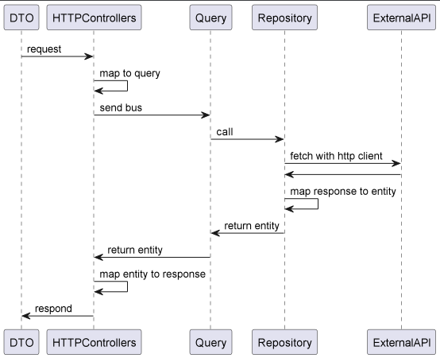
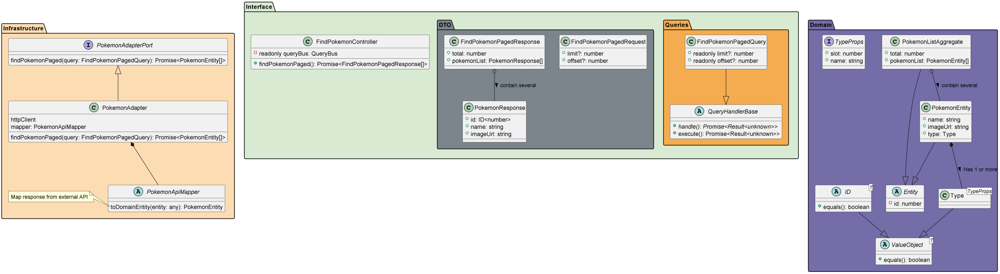

# Pokedex

This project aims to provide a NodeJS backend server for the Pokedex project.

## Prerequisites

The following should be installed on your computer :

-   [Node JS 14+](https://nodejs.org/)

## Installation

```bash
npm install
```


## Configuration

In the working directory, you will se an `.env.example` file. Simply copy the content of this file in a `.env` file.

On Mac OS / Linux :
```bash
cp .env.example .env
```
On windows :
```bash
copy .env.example .env
```

Here is a more detailed explanation of the keys :

| Key                        | Default                        | Description                                                                 |
| -------------------------- | -------------------------------|-----------------------------------------------------------------------------|
| PORT                       | `3001`                         | Port on which the webpack dev server will start.                            |
| POKE_API_URL               | `https://pokeapi.co/api/v2/`   | URL to the pokemon API                                                      |
| ALLOWED_ORIGINS            | `http://localhost:3001`        | URL of allowed client origins. Make sure the protocol, host and port match. |

## Running the app
To start the application, run the following :
```bash
# development
npm run start

# watch mode
npm run start:dev

# production mode
npm run start:prod
```

## Design

This application was designed following the DDH ([Domain Driven Hexagonale](https://nodejs.org/)(https://github.com/Sairyss/domain-driven-hexagon)) architecture.

To edit the UML diagram, you must install the [Plant UML](https://plantuml.com/fr/) plugin on your IDE.  If no plugin exist for you IDE, you can simply check the following.


> Query sequence




> Diagram class


